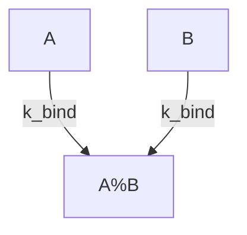

# ModelMermaidDiagram: Visualizing QSPy Models

The `ModelMermaidDiagram` object in the `qspy.utils.diagram` module provides a convenient way to generate flowchart-style diagrams of your QSPy models using [Mermaid](https://mermaid-js.github.io/mermaid/). These diagrams help you visualize the structure of your model, including compartments, species, and reactions, and can be embedded in Markdown documentation or exported to standalone files.

---

## What is `ModelMermaidDiagram`?

`ModelMermaidDiagram` is a utility class that takes a QSPy or PySB model and produces a Mermaid diagram representing the model's components and their interactions. This is especially useful for documentation, presentations, and model review.

---

## Key Features

- **Automatic diagram generation** from your model structure
- **Compartment, species, and reaction visualization**
- **Markdown and HTML export** for easy integration with documentation
- **File export** to `.mmd` (Mermaid) format

---

## Usage

### Basic Example

```python
# my_model.py
from qspy.core import Model
from qspy.utils.diagram import ModelMermaidDiagram

# Build your model here...
Model(name="MyModel")
# ... define monomers, parameters, rules, etc.

# Create a diagram object
ModelMermaidDiagram(model)
```

then

```python
# Import your model
from my_model import model

# Get the diagram as a Markdown block
markdown_block = model.mermaid_diagram.markdown_block

# Write the diagram to a Mermaid file
model.mermaid_diagram.write_mermaid_file("my_model_diagram.mmd")
```

### Including in Model Summary

If you attach a `ModelMermaidDiagram` instance to your model as (`model.mermaid_diagram`), it will be automatically included in the output of `model.markdown_summary()`:

---

## Example Output

A generated Mermaid diagram might look like:



When rendered in Markdown or HTML, this will appear as a flowchart showing the relationships between model components.

---

## Why Use ModelMermaidDiagram?

- **Clarity:** Visualize complex model structures at a glance.
- **Documentation:** Embed diagrams directly in your Markdown docs or reports.
- **Communication:** Share model architecture with collaborators and stakeholders.

---

## See Also

- [Model Summary Generator](model-summary-generator.md)
- [Mermaid Documentation](https://mermaid-js.github.io/mermaid/)